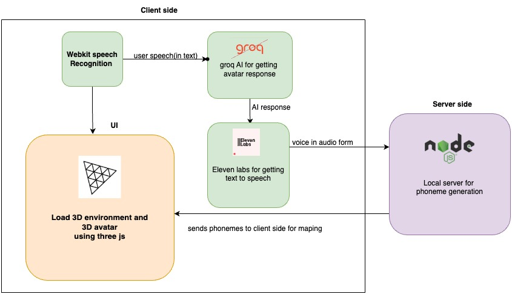

# InterviewPrep-Hackathon

## Project Description
InterviewPrep-Hackathon is a project designed to help individuals prepare for technical interviews. It provides a collection of coding challenges, resources, and tools to practice and improve coding skills. The project also includes a 3D avatar that interacts with users, providing a more engaging and interactive experience. **The app works both in VR and web, with a primary focus on VR, offering an immersive interview preparation experience. The 3D environment and VR capabilities make this app a unique offering in the market, providing users with a realistic and interactive way to practice for interviews.**

## How It Works
1. **Server Setup**: The Express server is set up in `server.js`, which also handles WebSocket connections using Socket.io.
2. **Phoneme Processing**: When a word is sent via WebSocket, the `phonemeProcessor` function in `phonemeServe.js` processes the word to generate its phonemes and emits the result back to the client.
3. **3D Scene and Avatar**: The 3D scene and avatar are set up in `main.js` using Three.js. The avatar's morph targets are changed based on the phoneme data.
4. **Text-to-Speech**: The `elevenlabs.js` file handles text-to-speech conversion and streams the audio data for playback.
5. **AI Responses**: The `llmResponse.js` file communicates with the Groq API to get responses from an AI model.
6. **User Interaction**: The HTML file (`index.html`) provides buttons for user interaction, such as starting the speech and handling microphone input.

## Technologies Used
- **Frontend**: HTML, CSS, JavaScript, Three.js
- **Backend**: Node.js, Express.js, Socket.io
- **Text-to-Speech**: Eleven Labs API
- **AI Responses**: Groq API
- **3D Models**: GLTFLoader from Three.js
- **VR Support**: WebXR

## Flow Diagram
Below is a flow diagram illustrating the technologies used in the project:



<!-- Add the actual path to your flow diagram image -->

## Getting Started
To get started with the project, follow these steps:

1. Clone the repository:
   ```bash
   git clone https://github.com/yourusername/InterviewPrep-Hackathon.git
   ```
2. Install the dependencies:
   ```bash
   cd InterviewPrep-Hackathon
   npm install
   ```
3. Start the server:
   ```bash
   npm start
   ```
4. Open your browser and navigate to `http://localhost:3300`.

## **Testing in VR**
To test the app in a VR headset, you can use the WebXR emulator. Follow these steps:

1. Install the WebXR Emulator extension for your browser:
   - For Chrome: [WebXR Emulator Extension](https://chromewebstore.google.com/detail/immersive-web-emulator/cgffilbpcibhmcfbgggfhfolhkfbhmik?hl=en)

2. Enable the WebXR Emulator extension in your browser.

3. Open the app in your browser and activate the WebXR Emulator to simulate a VR environment.

## Contributing
If you would like to contribute to the project, please fork the repository and submit a pull request. We welcome all contributions!

## License
This project is licensed under the MIT License. See the [LICENSE](LICENSE) file for details.
